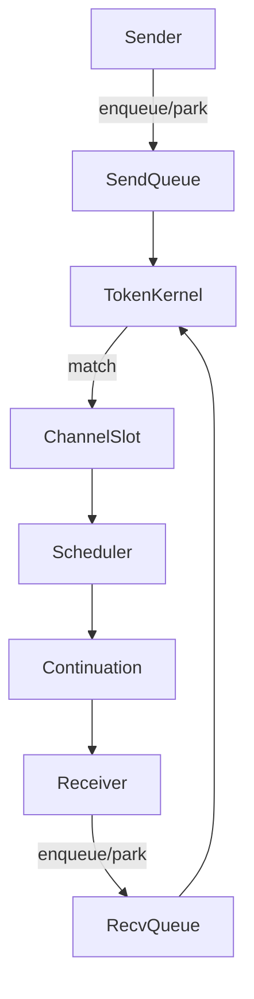

# Channel Design Overview (Verified)

_Last reviewed: 2025-11-01_

This file reflects the behaviour of `kc_chan.c` as implemented today. Update it alongside code changes that affect rendezvous, buffering, or zero-copy flows.

## Channel flavors at a glance

| Kind | What it means | When to use it |
|------|----------------|----------------|
| `KC_RENDEZVOUS` | Sender and receiver meet in the middle. No buffering. | Handshake-style protocols where the producer must wait for the consumer. |
| `KC_BUFFERED` | Bounded queue of fixed-size elements. | High-throughput pipelines where occasional bursts should not back up the producer immediately. |
| `KC_UNLIMITED` | Segmented, growable queue. | Convenience for tooling/tests when you do not want to think about capacity. |
| `KC_CONFLATED` | Single slot keeps only the most recent value. | State replication (“latest config wins”). |

All variants share the same core scaffolding: a mutex-protected struct, per-kind storage, and two wait queues (send and receive) implemented as linked lists of `kc_waiter` records.

## Life of a rendezvous

1. **Fast path (no waiters):**
   - Receiver arrives first → it pushes a waiter onto the receive queue and parks.
   - Sender arrives → it sees the waiting receiver, copies the payload directly into the receiver’s buffer, and schedules the receiver’s continuation.
2. **Both sides waiting:**
   - The token kernel keeps track of who is parked. Only one sender+receiver pair wins the match. Others remain queued.
3. **Resumption:**
   - When the winning match completes, the token kernel calls back into the scheduler (`koro_sched_enqueue_ready`) so the parked continuation resumes on the next scheduler tick.

Because kcoro_arena is stackless, suspend/resume boils down to “store the next step and return.” Channels never switch stacks—they only manage continuations.

## Buffered channels

Buffered channels add a ring buffer in front of the rendezvous mechanics:

- Producers write into the ring when it is not full. If it fills up, they fall back to the rendezvous path and park in the send queue.
- Consumers read from the ring while it has data. If it empties, they look for parked senders or park themselves.
- Resizing is automatic for the unlimited flavor; the buffer grows in chunks so we do not reallocate on every push.

## Pointer payloads and zero copy

The “ptr” variants (e.g., `kc_chan_send_ptr`) wrap arena descriptors. The important points are:

- The alias-LRU cache remembers recently seen descriptors so repeat sends of the same pointer avoid new lookups.
- Descriptors carry their own reference counts. The channel retains references while a message is in-flight and releases them once the consumer finishes.

## Flow at a glance

## Cancellation and close

- Cancelling a waiter removes it from the queue immediately and signals the coroutine with `KC_ECANCELED`.
- Closing a channel wakes both senders and receivers. Rendezvous pairs finish their current transfer first; buffered data is drained before close reports `KC_EPIPE`.

## Priority support (Added 2025-11-01)

The pending send and receive structures now include a `priority` field (uint8_t, 0-255) to support fairness in mixed workloads:

- **Priority constants**: `KC_CHAN_PRIORITY_LOW` (64), `KC_CHAN_PRIORITY_NORMAL` (128), `KC_CHAN_PRIORITY_HIGH` (192)
- **APIs**: `kc_chan_send_priority()` and `kc_chan_recv_priority()` accept a priority parameter
- **Queue insertion**: `kc_pending_send_insert_priority()` and `kc_pending_recv_insert_priority()` functions insert waiters by priority (higher values serviced first)

**Current status**: API infrastructure is in place. The public APIs currently delegate to standard send/recv operations. Full integration requires modifying the internal channel paths to use priority-aware insertion when the priority APIs are called.

## Broadcast/fanout utilities (Added 2025-11-01)

Helper functions for multi-recipient broadcast patterns:

- **`kc_chan_fanout_best_effort()`**: Attempts non-blocking send to multiple channels, returns count of successful operations. Suitable for fire-and-forget scenarios where partial delivery is acceptable.

- **`kc_chan_fanout_all_or_nothing()`**: Attempts to send to all channels, returns success only if all succeed. Note: true atomicity is difficult due to races; this function makes a best-effort attempt.

Both functions accept an array of channel pointers and a timeout parameter for individual send operations.

**Implementation note**: These are application-level utilities built on top of existing channel primitives, not new channel types.

## Further reading

- [Token kernel overview](../token_kernel/OVERVIEW.md) for the callback machinery.
- [Descriptor refcounting](../descriptors/DESCRIPTOR_REFCOUNTING.md) to understand the zero-copy path.
- `external/kcoro_arena/core/src/kc_chan.c` for the exact implementation (search for the block matching the channel kind you care about).

If you update the channel code, add a short note here so the mental model and reality stay aligned.
