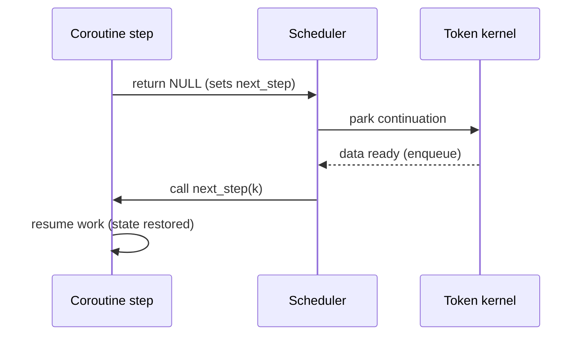

# Writing Stackless Coroutines by Hand

Most users lean on helper macros, but sometimes you need to understand what the macros generate or how to build a continuation manually. This guide walks through the core pieces in approachable steps.

## The shape of a continuation

```c
struct koro_cont {
    koro_step_fn next_step;  // Which function to call next
    int state;               // Optional scratch space for your own mini state machine
    void* user_data;         // Pointer to your locals struct
    // ... bookkeeping omitted ...
};
```

Key idea: **the continuation replaces the stack frame.** Anything you would keep on the C stack lives in `user_data` instead.

## Building a coroutine by hand

1. Allocate the continuation:
   ```c
   koro_cont_t* k = koro_cont_create(first_step, NULL, sizeof(struct locals));
   struct locals* st = k->user_data;
   st->counter = 0;
   ```
2. Enqueue it:
   ```c
   koro_sched_enqueue_ready(k);
   ```
3. Implement each step as a function that either:
   - Returns `NULL` to suspend, after setting `k->next_step` to the function that should run later.
   - Returns a non-`NULL` pointer (any value) to signal completion. The scheduler treats any non-`NULL` as “done”.

Example step:
```c
static void* counter_step(koro_cont_t* k) {
    struct locals* st = k->user_data;

    if (st->counter >= 10) {
        return (void*)1;  // Finished
    }

    printf("tick %d\n", st->counter++);
    k->next_step = counter_step;  // Run this step again next time
    return NULL;  // Suspend until the scheduler calls us again
}
```

## Quick visual: suspend and resume



## Using the helper macros

For day-to-day code, prefer the macros because they:
- Generate the continuation boilerplate.
- Provide `KORO_BEGIN`, `KORO_YIELD`, `KORO_SEND`, `KORO_RECV`, etc.
- Keep your code readable and cut down on footguns.

See `MACROS.md` in the same folder for the full reference.

## Debugging tips

- If a coroutine never resumes, check that you set `k->next_step` before returning `NULL`.
- When dealing with pointer payloads, remember to clean up `user_data` fields once the coroutine finishes; the scheduler frees the continuation, not your custom allocations.
- Use the scheduler’s ready-queue stats (exposed via tests) to confirm that coroutines leave the queue after they complete.

Keep this mental model handy and the generated macros will make a lot more sense.
