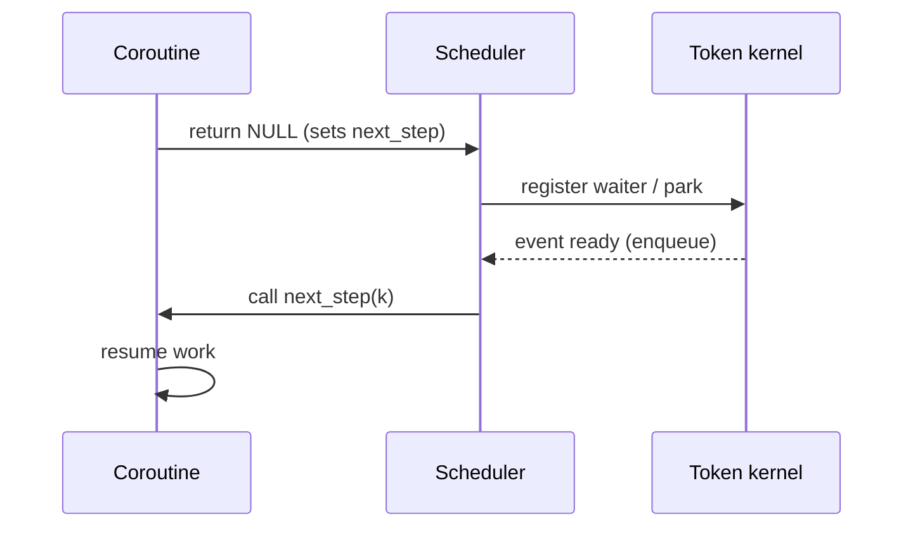

# Stackless Scheduler (Verified)

_Last reviewed: 2025-10-14_

## Purpose

The scheduler is an **event-driven dispatch loop** that executes stackless coroutines (continuations) on a single thread. It replaces the traditional OS thread scheduler with a lightweight, cooperative scheduler optimized for I/O-bound tasks.

## Core Loop

```c
void koro_run() {
    while (1) {
        struct koro_cont* k = dequeue_next_runnable();
        if (!k) {
            if (no_pending_events()) break;  // Exit
            wait_for_event();                // Block until I/O ready
            continue;
        }

        k->flags |= KORO_RUNNING;
        k->next_step(k);            // Execute one step
        k->flags &= ~KORO_RUNNING;

        if (k->flags & KORO_COMPLETED) {
            free_continuation(k);
        } else if (!(k->flags & KORO_SUSPENDED)) {
            enqueue_runnable(k);    // Still runnable, re-enqueue
        }
    }
}
```

## Key Concepts

### 1. Single Thread

All continuations execute on one thread. There is no parallelism—only concurrency (interleaving). Benefits:
- No data races on continuation state
- No stack swapping overhead
- Better cache locality (state stays warm)

### 2. Cooperative Scheduling

Continuations suspend explicitly via macros:
```c
KORO_SEND(k, ticket, data);  // Suspends here
```
No preemption: a continuation runs until it calls a suspend primitive or returns.

### 3. Event-Driven

The scheduler blocks on the arena’s callback system rather than spinning. When a continuation parks, the token kernel registers a waiter and the scheduler immediately moves on. When work is ready, the callback enqueues the continuation; `koro_run()` wakes up and dispatches it.

## Ready Queue Implementation

```c
struct koro_queue {
    struct koro_cont* head;
    struct koro_cont* tail;
};

void enqueue_runnable(struct koro_cont* k) {
    k->next = NULL;
    if (queue.tail) queue.tail->next = k;
    else queue.head = k;
    queue.tail = k;
}

struct koro_cont* dequeue_next_runnable() {
    if (!queue.head) return NULL;
    struct koro_cont* k = queue.head;
    queue.head = k->next;
    if (!queue.head) queue.tail = NULL;
    return k;
}
```

The production code wraps this queue with a `pthread_mutex_t`/`pthread_cond_t` to accept wakeups from a token-kernel worker thread. The cooperative semantics are unchanged.

### Managed vs. Manual Continuations

| Launch path                        | `managed` flag | Lifetime owner        | Typical use                            |
|------------------------------------|---------------|-----------------------|----------------------------------------|
| `koro_go(step, arg, local_size)`   | `1`           | Scheduler             | Fire-and-forget tasks                  |
| `koro_cont_create(...)` + enqueue | `0`           | Caller                | Reusable continuations / custom pools  |

- `koro_go()` marks continuations as managed and destroys them automatically when they complete.
- Manually created continuations (`koro_cont_create`) remain caller-owned; the caller is responsible for destroying or recycling them.

### Example (managed)

```c
static void* worker_step(koro_cont_t* k) {
    KORO_BEGIN(k);
    do_work();
    KORO_END(k);
}

void launch_worker(void) {
    koro_sched_init();
    koro_go(worker_step, NULL, 0);
    koro_run();
}
```

### Example (manual reuse)

```c
static void* manual_step(koro_cont_t* k) {
    struct state* st = k->user_data;
    KORO_BEGIN(k);
    process(st);
    KORO_END(k);
}

void reuse_manual(struct pool* pool) {
    koro_cont_t* k = checkout(pool);
    if (!k) k = koro_cont_create(manual_step, NULL, sizeof(struct state));
    init_state(k->user_data);
    koro_sched_enqueue_ready(k);
    koro_run();
    return_to_pool(pool, k);
}
```

## Suspend/Resume Flow (Visual)



## Idle Behaviour

- `koro_run()` blocks on the condition variable when there are no runnable continuations and no pending events.
- Callbacks signal the condition variable to wake the scheduler.
- Result: zero CPU usage when idle.

## Limitations

- Single-threaded execution; use multiple schedulers or workers for CPU-bound tasks.
- Cooperative only—misbehaving continuations can starve others if they never suspend.
- Requires CPS-aware code (no blocking I/O or `sleep()` inside continuations).

## Related Docs

- [Continuation guide (verified)](./CONTINUATION_GUIDE_VERIFIED.md)
- [Token kernel overview](../token_kernel/OVERVIEW_VERIFIED.md) (pending split)
- [Channel design (verified)](../channels/CHANNEL_DESIGN_VERIFIED.md)
